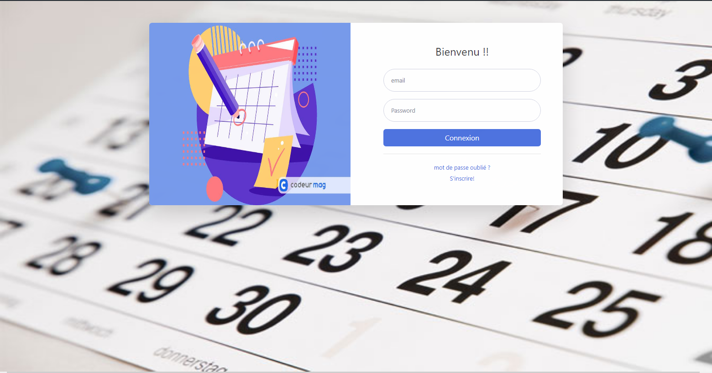

# TimeEvent: Application web Spring d'agenda électronique


* L'application permet à un utilisateur d'enregistrer un evenement à une date, de modifier un evenement et de le supprimer

* Les données seront dans une base de données H2 pour cette première implémentation

# STARTERS ET DEPENDANCES UTILISES

* Spring web
```xml
		<dependency>
			<groupId>org.springframework.boot</groupId>
			<artifactId>spring-boot-starter-web</artifactId>
		</dependency>

```

* Spring data JPA
```xml
		<dependency>
			<groupId>org.springframework.boot</groupId>
			<artifactId>spring-boot-starter-data-jpa</artifactId>
		</dependency>
``` 

# BASE DE DONNEES
Script sql : src/main/java/com/resources/data.sql

```sql
Drop table if exists utilisateur;

create table utilisateur (id int AUTO_INCREMENT primary key,
first_name varchar(250) not null,
last_name varchar(250) not null,
mail varchar(250) not null,
mdp varchar(250) not null);

Drop table if exists evenement;
create table evenement (id int AUTO_INCREMENT primary key,
titre varchar(250) not null,
descriptionEvenement varchar(255) DEFAULT null,
dateE varchar(15) not null,
id_utilisateur int not null);
```

# DEPLOIEMENT

* Copiez le fichier jar présent dans le dossier du projet, et executer le avec la commande : <b>java -jar kom-0.0.1-SNAPSHOT.jar</b>

* L'application sera déployé sur le port 3000: vous pourez vous connecter via votre navigateur avec ce lien (http://localhost:3000)


* Interface de Connexion:

<p align="center">
 </div>
</p>
